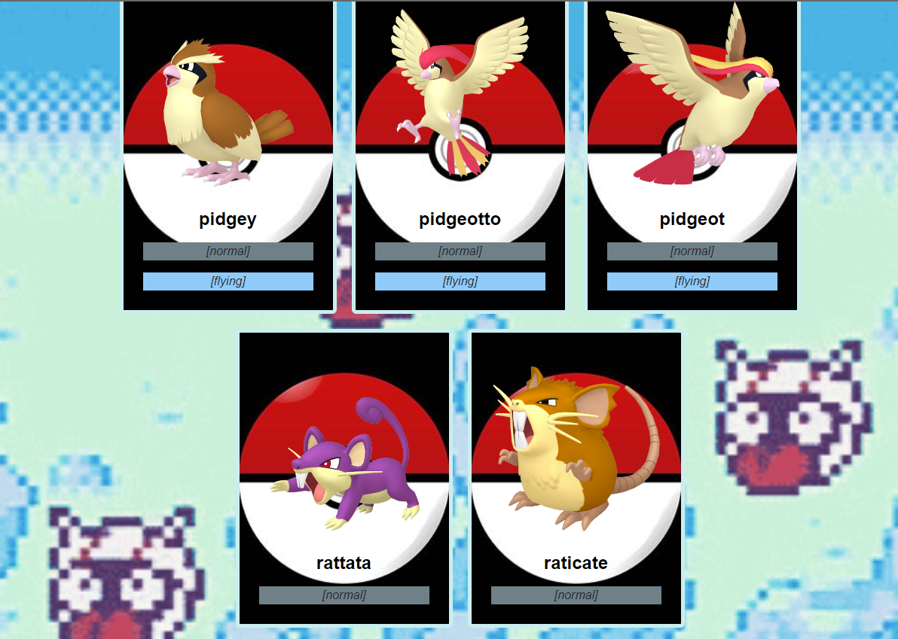

      <h1> Tarea 7 - Consumir API</h1>
     

# En que consiste
Consumir el siguiente endpoint https://pokeapi.co/api/v2/pokemon/ y mostrar en 
el front lo siguiente:
 - [ ] Cards que contengan los 20 primeros pokemones (imagen y nombre del pokemon)
 - [ ] Utilizar Async / Await para trabajar las promesas de forma asíncrona
 - [ ] Usar Axios o Fetch para realizar la solicitud al endpoint mencionado
 - [ ] Ocupar Try / Catch para el manejo de errores
# Screenshots
 
 
# Tecnologías utilizadas

    
      

